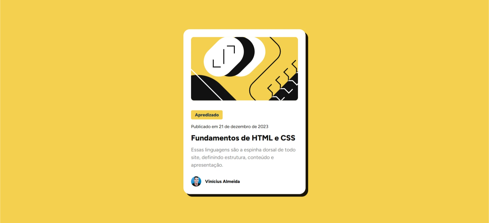

# Card HTML & CSS - (INICIANTE)
##  Visão geral
Esta é uma solução para o [ desafio do "Blog preview card" no Frontend Mentor ](https://www.frontendmentor.io/challenges/blog-preview-card-ckPaj01IcS).
O Desáfio é de replicar o design proposto.

###  Captura de tela

###  Links

- Url do meu Desáfio no FrontendMentor: []
- URL da solução no GitHub: [https://github.com/Vinicius-2a/Card-HTML-CSS-/]

##  Construído com
- React JS
- JAVASCRIPT

##  Autor
- Frontend Mentor - [ @vinicius-2a ](https://www.frontendmentor.io/profile/vinicius-2a)